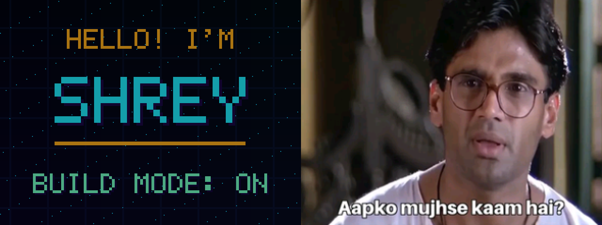

# Operation KAAM Badge

A reversible, self-contained wireless CTF and animated gallery for the
ESP32-C3 CryptoHack / HiP Badge `REL_0.8.12 SE`. Operation KAAM combines an
offline captive terminal, randomized physical-button defusal, a custom BLE
GATT puzzle, and a synchronized two-device finale.



## Highlights

- WPA2 SoftAP, DHCP, captive DNS, and an embedded HTTP terminal—no internet
  connection or backend required.
- Hidden web-recon trail with encoded clues and a stateful command console.
- Fresh randomized six-button vector with a 45-second defusal timer.
- Custom `SHREY_GHOST` BLE peripheral with read, write, and notification GATT
  characteristics.
- Two-client role assignment and a 15-second cooperative unlock window.
- Stable ST7789 rendering at 320×240 and four-button input through GPIO and a
  PCF8574 expander.
- A separate gallery with the original avatar, a neon `SHREY` card, and the
  supplied Hera Pheri frame with its original `Aapko mujhse kaam hai?` caption.

## Safety boundary

This project operates only through the network and BLE peripheral created by
the badge itself. It does not jam signals, transmit deauthentication frames,
impersonate third-party networks, capture credentials, or provide an internet
uplink. The terminal never requests or stores real credentials.

The screen redraws only when state changes, avoiding motion blur, shade
pulsing, and repeated-transfer artifacts.

## Play the Trapdoor

Power on the badge, join `SHREY_DEFCON` with password `4885-HEIST`, and let
the captive terminal open. The complete, spoiler-light play sequence is under
"Operation KAAM challenge flow" below. The final dual-phone command releases
the supplied Hera Pheri frame on the physical display and returns the game
flag. Start with `help`, `logs`, `status`, and `role`; additional commands are
revealed by the challenge.

Hold Button 4 for two seconds to shut down Wi-Fi and enter the original
gallery. In gallery mode, Buttons 1-3 directly select Avatar, SHREY, and Meme,
and Button 4 advances. Hold Button 4 again to restart the Trapdoor.

## Files

- `assets/avatar_source.png`: full-resolution generated source art.
- `assets/avatar_screen_preview.png`: exact RGB565 preview.
- `assets/avatar_animation_preview.gif`: desktop preview of the loop.
- `assets/hera_pheri_meme_source.png`: earlier generated Bollywood artwork.
- `assets/hera_pheri_suniel_meme_source.png`: user-supplied meme frame currently
  embedded in the firmware.
- `assets/meme_screen_preview.png`: exact RGB565 meme image preview.
- `assets/showcase_animation_preview.gif`: desktop preview of both new scenes.
- `assets/new_scenes_preview.png`: representative contact sheet for visual QA.
- `main/avatar_rgb565.bin`: 320x240 embedded screen asset.
- `main/meme_rgb565.bin`: 320x240 embedded meme asset.
- `main/portal.html`: compact captive-terminal interface embedded in flash.
- `main/trapdoor.c`: WPA2 AP, DHCP/DNS captive routing, HTTP API, and challenge
  state machine.
- `main/ghost_ble.c`: custom NimBLE service, advertisement gating, puzzle
  characteristics, and BLE-answer validation.
- `main/main.c`: button polling, Operation KAAM/gallery switching, and display
  scene rendering.
- `tools/make_avatar.py`: replaces the art with any PNG/JPEG or the first
  frame of a GIF.
- `tools/make_meme.py`: crops full-screen artwork and converts it to RGB565.
- `tools/make_showcase_preview.py`: renders the new firmware scenes on desktop.

## Button controls

The four green buttons are numbered left-to-right in the badge's normal
landscape orientation:

- Button 1 / leftmost: show the avatar (`TACT_C`, PCF8574 P1).
- Button 2: show the `SHREY` card (`TACT_D`, PCF8574 P2).
- Button 3: show the meme (`TACT_A`, `GPIO10`, also PCF8574 P3).
- Button 4 / rightmost: advance to the next scene (`TACT_B`, `GPIO9`).

The PCF8574 is read over I2C at address `0x20`, using GPIO20 for SDA and
GPIO21 for SCL. This production wiring supersedes older HiP Badge GPIO maps.

## Flash layout

Wi-Fi and the HTTP stack make the application larger than the badge's original
1 MB app slot. `partitions.csv` uses a 2 MB factory application partition and
reserves the remaining 1,984 KB as `storage` for future game content. The badge
has 4 MB flash, and the exact original 4 MB image remains recoverable from the
backup below.

## Local toolchain

This working copy uses ESP-IDF 5.1.4 installed under the ignored
`.toolchains/` directory. Activate it from the project root with:

```sh
export IDF_TOOLS_PATH="$PWD/.toolchains/espressif"
. .toolchains/esp-idf/export.sh
idf.py --version
```

The badge used for this build appears as `/dev/cu.usbmodem101` on macOS.

## Factory backup and recovery

A full 4 MB factory backup was captured before flashing:

`backups/cryptohack-stock-2026-08-10-9888e050a6d8.bin.backup`

Its SHA-256 is:

`80088aad980f255fc21eb220bfd2919ee64e4472f56080a5e7f4407cd2a2a14f`

To restore the exact original contents later:

```sh
./.venv/bin/python -m esptool --chip esp32c3 \
  -p /dev/cu.usbmodem101 write_flash 0x0 \
  backups/cryptohack-stock-2026-08-10-9888e050a6d8.bin.backup
```

Keep that backup file safe. It contains the badge's original firmware and
data; it is intentionally excluded from Git.

## Build and flash

```sh
idf.py set-target esp32c3
idf.py build
idf.py -p /dev/cu.usbmodem101 flash monitor
```

If flashing waits at `Connecting...`, switch the badge off, hold the
rightmost green button (Button 4 / BOOT), switch it on, wait two seconds,
then release the button and retry the flash command.

Exit the serial monitor with `Ctrl-]`.

## Operation KAAM challenge flow

The default badge mode is now a four-layer, self-contained wireless CTF:

1. Join `SHREY_DEFCON` with password `4885-HEIST` and open
   `http://192.168.4.1/`.
2. Inspect the terminal, recovery logs, and page source to locate the hidden
   Sector 7 endpoint. Decode its hex payload, then arm that word in the
   terminal.
3. Enter the newly randomized six-button vector on the badge within 45
   seconds. Buttons are numbered 1-4 from left to right.
4. The badge then advertises the custom BLE peripheral `SHREY_GHOST`. Use a
   BLE GATT client to read the clue characteristic, decode its Caesar fragment,
   and write the plaintext answer to the answer characteristic.
5. Two different phones must each run `role` in the Wi-Fi terminal. Each gets
   a different secret fragment. Submit both with `sync <fragment>` inside the
   15-second dual-auth window to open the vault.

If the sync window expires, run `sync start` after both roles are registered.
The legacy one-phone `submit` shortcut is intentionally disabled. Hold the
rightmost badge button for two seconds to switch between Operation KAAM and
the avatar/name/meme gallery.

## Use another avatar, meme, or GIF

Pillow is required by the converter:

```sh
python3 -m pip install Pillow
python3 tools/make_avatar.py path/to/your-image.gif
python3 tools/make_animation_preview.py assets/avatar_screen_preview.png
idf.py build flash
```

For GIF input this version intentionally uses the first frame and adds
cheap firmware-side animation. That keeps the asset to 153,600 bytes;
embedding every frame would consume flash quickly.

## Display troubleshooting

- Production pin note: the original factory firmware drives the display
  with `GPIO1` as chip-select and handles panel reset through `GPIO4`.
  This project follows that factory-proven behavior even though the
  published schematic labels can suggest otherwise.
- Upside-down image: change the two arguments to
  `esp_lcd_panel_mirror()` in `main/avatar_display.c`.
- Portrait/cropped image: change `esp_lcd_panel_swap_xy()` to `false`.
- Button switching uses the factory-proven 20 MHz display clock and 32-row
  DMA transfers for responsive full-screen changes.
- Psychedelic colors or broad false-color bands: RGB565 assets are stored
  little-endian, and `panel_config.data_endian` must remain set to
  `LCD_RGB_DATA_ENDIAN_LITTLE`.
- Blank screen: power-cycle once. If it remains blank, flash the saved
  factory backup to separate a display hardware problem from an application
  configuration problem.

Do not run eFuse, secure-boot, flash-encryption, `stage`, or `prod`
provisioning commands for this visual demo.

## License and media

The original source code and utility scripts are available under the MIT
License; see `LICENSE`. Third-party movie imagery and user-supplied media retain
their respective rights and are not covered by the software license.
